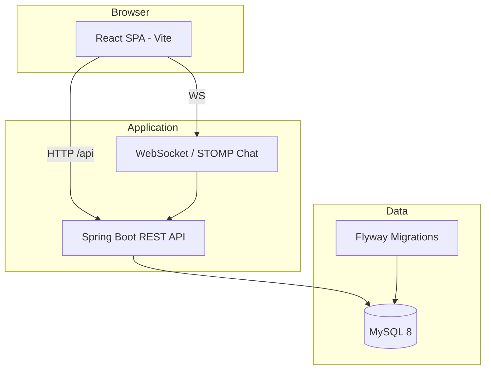

SportsHub — Sports Equipment E-Commerce Platform

A full-stack, production-oriented sports retail platform with a customer storefront, admin console, and REST API. Built as a final-year e-commerce system with clean separation between UI, business logic, and persistence.

Overview

SportsHub lets shoppers browse sports gear by category, manage a cart and wishlist, check out with configurable shipping and tax rules, and track orders. Administrators manage catalog, orders, marketing content, system settings, and live customer support chat—all backed by a stateless JWT-secured Spring Boot API and a React single-page application.

| Layer | Stack |
|-------|--------|
| **Frontend** | React 18, Vite 5, React Router 6, Tailwind CSS, Radix UI, Axios |
| **Backend** | Java 21, Spring Boot 3.3, Spring Security, Spring Data JPA, WebSocket (STOMP) |
| **Database** | MySQL 8.0 (Flyway migrations) |
| **Auth** | JWT access + refresh tokens, BCrypt passwords, role-based access (`USER`, `ADMIN`) |
| **Ops** | Docker Compose, GitHub Actions CI |

---

Features

### Customer storefront

- Product catalogue with categories, filters, search, variants, and local editorial product images
- Product detail pages with reviews, related items, and recently viewed
- Shopping cart (guest merge on login) and wishlist
- Checkout with address capture, optional Google Places autocomplete, shipping fees, and tax
- Order history and order confirmation
- Account settings: profile, addresses, password, marketing preferences
- Real-time customer support chat (WebSocket)
- Static pages: About, Contact, Terms, Privacy

### Admin console (`/admin`)

- Dashboard metrics and order management
- Product CRUD (admin-only write endpoints)
- Marketing / storefront content management
- System settings: payments (Stripe-ready), shipping regions, tax, notifications, password policy
- Support chat inbox
- Admin profile and account settings

### Platform & API

- RESTful API under `/api/*` with consistent JSON error responses
- Flyway schema versioning (22+ migrations) with seed data
- Rate limiting, CORS configuration, audit logging on sensitive routes
- Actuator health endpoints for operations
- H2 in-memory database for automated tests; MySQL for dev and Docker

---

## Architecture



**Design:** Controller → Service → Repository (clean architecture). DTOs separate API contracts from JPA entities. Frontend uses React Context for auth, cart, and commerce config, with an Axios client that handles token refresh.

---

## Repository structure

```
Sports_Equpiments_E-commerce/
├── .frontend/          # React + Vite customer & admin UI
├── .backend/           # Spring Boot API
├── .github/workflows/  # CI (backend tests, frontend build, release check)
├── scripts/            # release-check.sh and tooling
├── docker-compose.yml  # MySQL + backend + frontend (nginx)
└── README.md
```

| Path | Purpose |
|------|---------|
| `.frontend/src/pages/` | Route-level pages (shop, checkout, admin) |
| `.frontend/src/services/` | API clients (catalogue, cart, orders, chat, …) |
| `.frontend/public/images/products/` | Local product image assets |
| `.backend/src/main/java/.../controller/` | REST controllers |
| `.backend/src/main/java/.../service/` | Business logic |
| `.backend/src/main/resources/db/migration/` | Flyway SQL migrations |

---

## Prerequisites

| Tool | Version | Notes |
|------|---------|--------|
| **Node.js** | 20.x | Frontend dev & build |
| **npm** | 9+ | Comes with Node |
| **JDK** | 21 | Backend |
| **Maven** | 3.9+ | Backend build & tests |
| **Docker Desktop** | Latest | Optional; full stack via Compose |
| **MySQL** | 8.0 | Required only for local backend without Docker |

---

## Quick start

Choose one workflow depending on your goal.

### Option A — Frontend only (demo mode)

No Java or database required. The UI falls back to demo catalog data when the API is offline.

```powershell
cd .frontend
Copy-Item .env.local.example .env.local
npm install
npm run dev
```

Open **http://localhost:5173**

### Option B — Full stack with Docker (recommended)

Runs MySQL, the API, and a production build of the frontend.

```powershell
# From repository root
docker compose up -d --build
```

| Service | URL |
|---------|-----|
| Frontend (nginx) | http://localhost:3000 |
| Backend API | http://localhost:8080 |
| MySQL (host) | `localhost:3307` (mapped from container 3306) |

Stop services:

```powershell
docker compose down
```

If MySQL credentials were changed after the first run, reset the volume once:

```powershell
docker compose down -v
docker compose up --build
```

For hot-reload UI development alongside Docker API:

```powershell
docker compose up db backend -d
cd .frontend
npm run dev
```

Then use **http://localhost:5173** (Vite) with API at **http://localhost:8080**.

### Option C — Backend on host + frontend dev

1. Create database `sports_ecommerce` in local MySQL 8.
2. Configure backend environment (see [Environment variables](#environment-variables)).
3. Start API:

```powershell
cd .backend
Copy-Item .env.dev.example .env.local
# Edit .env.local with your DB credentials
mvn spring-boot:run
```

4. Start frontend (Option A) in a second terminal.

---

## Environment variables

### Backend (`.backend/.env.local` or Docker `environment`)

Copy from `.backend/.env.dev.example`.

| Variable | Description |
|----------|-------------|
| `SERVER_PORT` | HTTP port (default `8080`) |
| `DB_URL` | JDBC URL, e.g. `jdbc:mysql://localhost:3306/sports_ecommerce` |
| `DB_USERNAME` / `DB_PASSWORD` | Database credentials |
| `JWT_SECRET` | Signing secret (minimum 32 characters) |
| `CORS_ALLOWED_ORIGIN_PATTERNS` | Comma-separated patterns, e.g. `http://localhost:*` |
| `PRODUCT_IMAGE_SOURCE` | `local`, `unsplash`, or `firebase` |

### Frontend (`.frontend/.env.local`)

Copy from `.frontend/.env.local.example`.

| Variable | Description |
|----------|-------------|
| `VITE_API_BASE_URL` | Backend base URL (default `http://localhost:8080`) |
| `VITE_PRODUCT_IMAGE_SOURCE` | `local` (recommended), `firebase`, or `unsplash` |
| `VITE_GOOGLE_MAPS_API_KEY` | Optional; Places autocomplete on checkout |
| `VITE_STOREFRONT_URL` | Optional; separate customer origin for admin redirects |
| `VITE_ALLOW_DEMO_FALLBACK` | Allow mock data in production builds when `true` |

Never commit real secrets. `.env` and `.env.local` are gitignored.

---

## API overview

Base URL: `http://localhost:8080` (when running locally).

| Area | Base path | Auth |
|------|-----------|------|
| Authentication | `/api/auth` | Public (register, login, refresh, logout) |
| Catalog | `/api/products`, `/api/categories` | GET public; write `ADMIN` |
| Storefront | `/api/storefront` | Public read |
| Cart | `/api/cart` | Authenticated |
| Wishlist | `/api/wishlist` | Authenticated |
| Orders | `/api/orders` | Authenticated |
| Profile & settings | `/api/profile`, `/api/account` | Authenticated |
| Reviews | `/api/reviews` | Mixed |
| Chat | `/api/chat`, `/ws` | Authenticated |
| Admin | `/api/admin` | `ADMIN` |
| Admin settings | `/api/admin/settings` | `ADMIN` |
| Health | `/actuator/health` | Public |

**HTTP status conventions**

- `401 Unauthorized` — not signed in (missing or invalid JWT)
- `403 Forbidden` — signed in but insufficient role or access

---

## Running tests & CI

### Backend unit & integration tests

```powershell
cd .backend
mvn test
```

Uses the `test` profile with in-memory H2 and Flyway migrations.

### Frontend production build

```powershell
cd .frontend
npm install
npm run build
```

### Full release checklist (matches CI)

```bash
bash ./scripts/release-check.sh
```

Requires Docker CLI for `docker compose config` validation.

### GitHub Actions

On every push and pull request, CI runs:

1. **backend** — `mvn -B test`
2. **frontend** — `npm install` + `npm run build`
3. **release-check** — backend tests, frontend build, Compose config validation

---

## Product images

Local images are the default path:

1. Assets live under `.frontend/public/images/products/`
2. Manifest: `.backend/src/main/resources/product-image-manifest.json`
3. Regenerate manifest after adding assets:

```powershell
cd .frontend
npm run generate:product-manifest
```

Set `VITE_PRODUCT_IMAGE_SOURCE=local` and `PRODUCT_IMAGE_SOURCE=local` for consistent resolution.

---

## Troubleshooting

| Issue | What to try |
|-------|-------------|
| Shop shows no products / errors | Start the backend, or use demo mode (Option A) |
| CORS errors with Vite | Backend allows `http://localhost:*` by default |
| Port 5173 in use | Use Docker UI on port **3000**, or stop the conflicting process |
| MySQL auth failed in Docker | `docker compose down -v` then rebuild |
| CI backend test failures | Run `mvn test` in `.backend` and read Surefire reports under `target/surefire-reports/` |

More frontend notes: [.frontend/HOW_TO_RUN.md](.frontend/HOW_TO_RUN.md)

---

## Security notes (development)

- Replace default `JWT_SECRET` and database passwords before any public deployment.
- Stripe secret keys are never returned from admin settings GET endpoints.
- Generated Spring Security passwords in logs are for dev only—use JWT auth in the app.
- Restrict Google Maps API keys by HTTP referrer in production.

---

## Contributing

1. Create a feature branch from `main`.
2. Keep changes focused; follow existing package and naming conventions.
3. Run `mvn test` and `npm run build` before opening a PR.
4. Ensure GitHub Actions CI passes (green checks on the commit).

---

## Authors

Final Year Project — Sports Equipment E-Commerce  
Developed by **HeinHtetAung3** and contributors.

---
